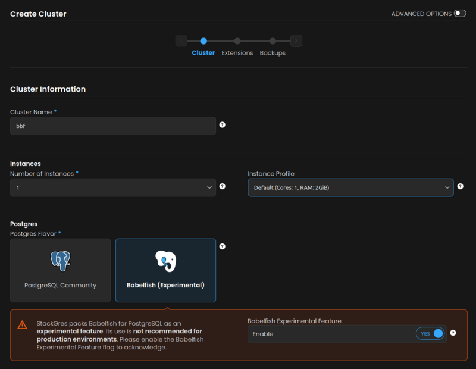
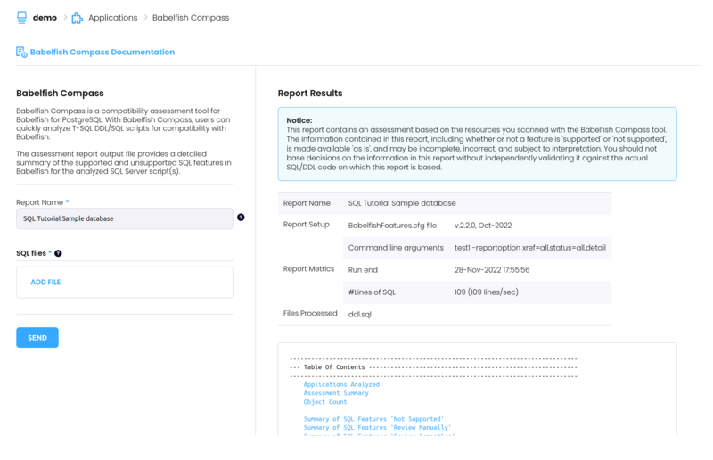

# Babelfish on EKS demo


## Pre-requisites

You will need an EKS cluster. If you don't have one, you can create one with a command similar to:

```sh
eksctl --region us-west-2 create cluster --name stackgres \
    --node-type m6g.2xlarge \
    --node-volume-size 100 \
    --nodes 2 \
    --zones us-west-2a,us-west-2b,us-west-2c \
    --version 1.21
```

Verify that you can connect to the cluster with commands like `kubectl cluster-info` and `kubectl get nodes`.


## Deploying a Babelfish server

For this demo, the open source [StackGres](https://stackgres.io) platform will be used. It provides a very easy way to boostrap a Babelfish server on EKS.

Then you can proceed to install StackGres with Helm:

```sh
helm repo add stackgres-charts https://stackgres.io/downloads/stackgres-k8s/stackgres/helm/

helm install --create-namespace --namespace stackgres stackgres-operator \
    --set-string adminui.service.type=LoadBalancer \
    stackgres-charts/stackgres-operator
```

Note that the above command will create an AWS Load Balancer (which will incur in additional costs to the EKS cluster and nodes EBS volumes). This load balancer is used to expose the StackGres Web Console, which will be used to crete the Babelfish cluster. To access the Web Console we need to retrive its URL:

```sh
kubectl -n stackgres get svc --field-selector metadata.name=stackgres-restapi  
```

The URL will be ``https://` followed by the DNS name specified in the `EXTERNAL-IP` field of the output of the previous command. Open it on a browser and accept the security risks (it's normal, it is using a self-signed SSL certificate).

The username is `admin`, the password can be retrieved with:

```sh
kubectl get secret -n stackgres stackgres-restapi --template '{{ .data.clearPassword | base64decode }}'
```

Create a namespace for the babelfish cluster:

```sh
kubectl create namespace demo
```

and then proceed to create the Babelfish cluster either via the Web Console:



or from the command line:

```yaml
kubectl apply -f - <<EOF
heredoc> kind: SGCluster
apiVersion: stackgres.io/v1
metadata:
  namespace: demo    
  name: bbf
spec:
  instances: 1
  postgres:
    version: 'latest'
    flavor: babelfish
  pods:
    persistentVolume:
      size: '10Gi'
  nonProductionOptions:
    enabledFeatureGates: [ "babelfish-flavor" ]
EOF
```

## Accesing Babelfish

You can connect now to your cluster with any application that speaks the SQL Server (TDS) protocol. For simplicity here, we can use the [usql](https://github.com/xo/usql) universal CLI database client, which is included in `ongres/postgres-util` container image. Run as:

```sh
kubectl -n demo run usql --rm -it --image ongres/postgres-util --restart=Never -- usql --password ms://babelfish@bbf:1433
```

to get the password:

```sh
kubectl -n demo get secret bbf --template '{{ printf "%s" (index .data "babelfish-password" | base64decode) }}'
```

and finally you can run SQL Server queries like in:

```sql
If you don't see a command prompt, try pressing enter.
Enter password: 
Connected with driver sqlserver (Microsoft SQL Server 12.0.2000.8, , Standard Edition)
Type "help" for help.

ms:babelfish@bbf:1433=> select @@version;
                                    version                                    
-------------------------------------------------------------------------------
 Babelfish for PostgreSQL with SQL Server Compatibility - 12.0.2000.8         +
 Oct 29 2022 15:17:47                                                         +
 Copyright (c) Amazon Web Services                                            +
 PostgreSQL 14.3 (OnGres 14.3-bf2.1.1-build-6.17) on aarch64-unknown-linux-gnu 
(1 row)

ms:babelfish@bbf:1433=> ^D
```

or create some real table and data to query like in:

```sql
ms:babelfish@localhost=> create schema sch1;
CREATE SCHEMA
ms:babelfish@localhost=> create table [sch1].test (
ms:babelfish@localhost(> pk int primary key identity(1,1),
ms:babelfish@localhost(> text varchar(50),
ms:babelfish@localhost(> t datetime);
CREATE TABLE
ms:babelfish@localhost=> insert into  [sch1].test (text, t) values ('hi', getdate());
INSERT 1
ms:babelfish@localhost=> select * from [sch1].test;
 pk | text |            t             
----+------+--------------------------
  1 | hi   | 2022-11-28T18:01:33.143Z 
(1 row)
```


## Babelfish COMPASS

[Babelfish COMPASS](https://github.com/babelfish-for-postgresql/babelfish_compass) is a COMPAtibility ASSessment tool that produces a report about the level of compatibility of a SQL Server DDL with Babelfish. COMPASS has been integrated into the StackGres Web Console and can be accessed from the left pane `Applications -> babelfish-compass`.

This integration allows you to upload from the Web Console the DDL file. We may give it a try with the [SQL Server Tutorial's Sample Database](https://www.sqlservertutorial.net/sql-server-sample-database/), which you can [download here](https://www.sqlservertutorial.net/wp-content/uploads/SQL-Server-Sample-Database.zip). Unzip the contents of the `.zip` and rename the file `BikeStores Sample Database - create objects.sql` to `ddl.sql`.

Now you can upload this `ddl.sql` file and have the compatibility report generated for you:

